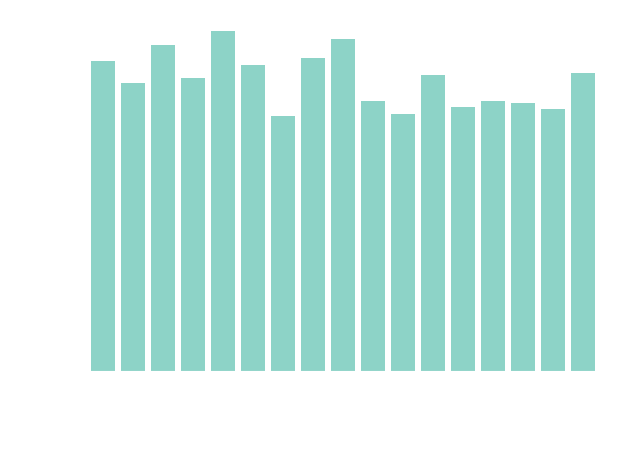

# Codegolf-Submissions
All submissions I have made to [Code Golf](https://code.golf/) in various languages. Note that I do not use encoding tricks in my submissions so my ranking is only concerned with bytes (which will be identical to chars).
# Currently In Progress:
## 12 days of Christmas
| Language | Bytes | Rank (in bytes)
|:---:|:---:|:---:|
|C|524|27|
|C#|486|17|
|C++|550|13|
|Elixir|494|5|
|Fortran|573|9|
|Go|517|8|
|Java|561|21|
|JavaScript|455|29|
|K|434|7|
|Lua|500|6|
|Python|455|34|
|Raku|452|8|
|Ruby|442|23|
|Rust|503|8|

# Usage Notes
Use requirements.txt to check for any changes for this file. 
Use the command `git config core.hooksPath hooks` to assign `hooks\pre-commit` as a hook of this repository (otherwise this README will break!) 
Don't commit too fast or too many times at once since the hooks web scrap for rank (which might ratelimit your IP). 
